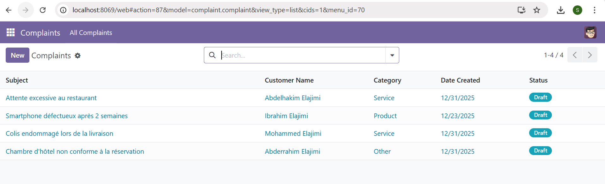
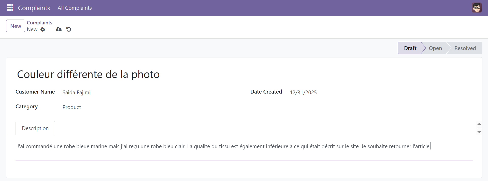

# 🛠️ Module Odoo 17 : Gestion des Plaintes Clients

<p align="center">
  
</p>

## 📌 Présentation du Projet
Ce projet consiste en la création d'un module personnalisé pour **Odoo 17**, conçu pour moderniser et automatiser la gestion des réclamations clients. Développé dans le cadre du module **ERP (LAB 2)**, il illustre l'implémentation complète d'un processus métier au sein d'un ERP.

> **Objectif :** Offrir une interface intuitive pour enregistrer, catégoriser et résoudre les plaintes tout en assurant une traçabilité complète.

---

## 🏗️ Architecture Technique
Le module repose sur une architecture **MVC (Modèle-Vue-Contrôleur)** standard d'Odoo :
- **Backend :** Python 3.10+ (Framework Odoo)
- **Frontend :** XML (QWeb Views)
- **Base de données :** PostgreSQL 15/16
- **Environnement :** Containerisation Docker & Docker Compose

---

## ✨ Fonctionnalités Clés

### 📝 Gestion des Réclamations
- **Formulaire complet :** Saisie du sujet, nom du client, date et description détaillée.
- **Catégorisation :** Classification par type (Service, Produit, Autre) pour faciliter l'analyse.

### 🔄 Workflow et États
Suivi du cycle de vie d'une plainte grâce à un système d'états :
- 🟢 **Brouillon (Draft)** : Nouvelle plainte saisie.
- 🟡 **Ouvert (Open)** : Plainte en cours de traitement.
- 🔵 **Résolu (Resolved)** : Solution apportée au client.

### 🔍 Interface et Recherche
- **Vues Personnalisées** :
  - **Tree View** : Liste globale avec badges colorés selon le statut.
  - **Form View** : Détails riches avec barre de progression de statut.
- **Filtres Avancés** : Recherche par client, catégorie ou statut pour une navigation rapide.

---

## 📂 Structure du Module
```bash
complaint_management/
├── __init__.py            # Initialisation Python
├── __manifest__.py        # Métadonnées et dépendances
├── models/
│   ├── __init__.py
│   └── complaint.py       # Définition du modèle de données
├── views/
│   └── complaint_views.xml # Menus, Actions et Vues (XML)
└── security/
    └── ir.model.access.csv # Droits d'accès (ACL)
```

---

## � Installation Rapide

### 1. Prérequis
- Docker et Docker Compose installés sur votre machine.

### 2. Lancement
```bash
# Lancer les conteneurs (Odoo + Postgre)
docker-compose up -d
```

### 3. Activation du Module
1. Connectez-vous à `http://localhost:8069`.
2. Activez le **Mode Développeur** (dans les Paramètres).
3. Naviguez vers le menu **Applications**.
4. Cliquez sur **"Mettre à jour la liste des applications"**.
5. Recherchez **"Complaint Management"** et cliquez sur **Activer**.

---

## � Aperçu du Module

### Vue Liste (Dashboard)


### Formulaire de Création


---

## 🎓 Équipe du Projet
- **Réalisé par :** Saida EL AJIMI (G8_5IIR)
- **Encadré par :** Mohammed Baitdaoud
- **Année Académique :** 2025-2026

---

## 📑 Annexes
- [📄 Télécharger le Rapport PDF Complet](SaidaElajimiG8_Rapport_Gestion_des_Plaintes_Clients.pdf)
